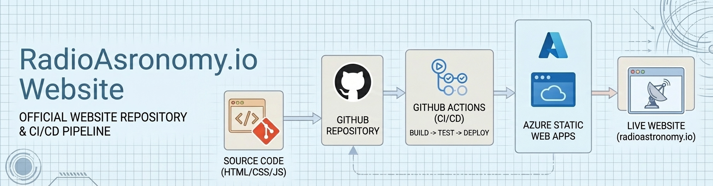
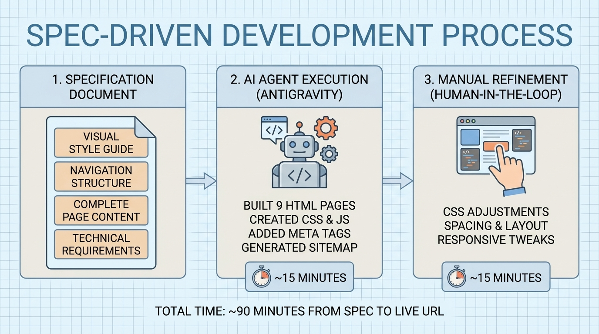
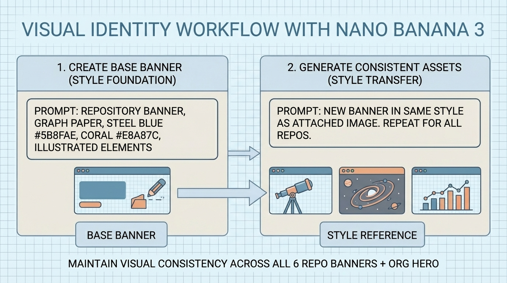

# 🌐 RadioAstronomy.io Website

> An experiment in spec-driven development — from specification to live site in 90 minutes using AI agents, style-consistent graphics, and Azure Static Web Apps.

[](https://radioastronomy.io)
[](https://azure.microsoft.com/en-us/products/app-service/static)
[](https://github.com/features/actions)
[](https://developer.mozilla.org/en-US/docs/Web/HTML)
[](https://developer.mozilla.org/en-US/docs/Web/CSS)
[](https://developer.mozilla.org/en-US/docs/Web/JavaScript)
[](LICENSE)



This repository contains the public website for the [radioastronomyio](https://github.com/radioastronomyio) GitHub organization — a 9-page static site showcasing computational astronomy research projects, infrastructure documentation, and data science methodologies. The site was built as an open experiment in spec-driven development, demonstrating how AI coding agents can transform a detailed specification into production-ready code with minimal manual intervention.

---

## 🎯 Quick Navigation

### For Site Visitors

- [🌐 Live Site](https://radioastronomy.io) — The deployed website
- [📖 Research Overview](https://radioastronomy.io/research.html) — Galaxy evolution, cosmic voids, quasar physics
- [🖥️ Infrastructure](https://radioastronomy.io/infrastructure.html) — Compute cluster and data architecture

### For Developers

- [📋 Website Specification](docs/website-reference.md) — Complete content and style reference
- [🎨 CSS Architecture](src/css/styles.css) — Commented stylesheet with design rationale
- [⚡ JavaScript](src/js/main.js) — Dual-audience commented interactivity

### For Replicators

- [1. Spec-Driven Development](#-spec-driven-development) — The methodology
- [2. Visual Identity](#-visual-identity-with-nano-banana-3) — Consistent graphics workflow
- [3. Azure Static Web Apps](#-azure-static-web-apps) — Free hosting tutorial

---

## 🧪 Open Methodology

This project documents its entire development process. The goal isn't just a website — it's a reproducible template for spec-driven static site development.

| Metric | Value |
|--------|-------|
| Total time (spec → live site) | ~90 minutes |
| Specification size | ~2,000 words |
| AI agent execution | ~15 minutes (4 iterative prompts) |
| Manual refinement | ~15 minutes |
| Pages | 9 (3 main + 6 repository pages) |

---

## 🏗️ Repository Structure

```
radioastronomyio-website/
├── 🎨 assets/                        # Banners and infographics
├── 📚 docs/
│   └── website-reference.md          # The specification
├── 🌐 src/                           # Deployed to Azure SWA
│   ├── index.html
│   ├── research.html
│   ├── infrastructure.html
│   ├── repos/                        # 6 repository detail pages
│   ├── css/styles.css               # Commented stylesheet
│   ├── js/main.js                   # Commented interactivity
│   ├── assets/                       # Site images
│   ├── sitemap.xml
│   └── staticwebapp.config.json     # Caching, headers, routing
├── 📝 work-logs/                     # Development history
└── ⚙️ .github/workflows/
    └── azure-static-web-apps-*.yml   # Auto-generated by Azure
```

---

## 📋 Spec-Driven Development

The core idea: write a complete specification before any code exists, then hand it to an AI coding agent.



### The Specification Document

We created [`docs/website-reference.md`](docs/website-reference.md) containing:

| Section | Contents |
|---------|----------|
| Visual style guide | Color palette, typography, card styles (derived from existing graphics) |
| Navigation structure | Page hierarchy, dropdown behavior, mobile patterns |
| Complete page content | Every heading, paragraph, and section for all 9 pages |
| Technical requirements | SEO meta tags, structured data, accessibility notes |

The spec was ~2,000 words covering everything needed to build the site without ambiguity.

### AI Agent Execution

We used [Antigravity](https://www.antigravity.dev/) (Flash tier) with the spec as input. The agent:

- Built all 9 HTML pages with content from the spec
- Created CSS with custom properties matching the style guide
- Implemented JavaScript for navigation, scroll effects, animated counters, lightbox, and collapsibles
- Added Open Graph and Twitter Card meta tags
- Generated sitemap.xml

Total agent execution time: ~15 minutes over 4 iterative prompts of increasing difficulty.

### Manual Refinement

Some CSS adjustments were made interactively with Claude:

| Adjustment | Reason |
|------------|--------|
| Banner width 100% → 80% | Full-width felt visually heavy |
| Container width % → fixed px | Proper zoom behavior |
| Spacing xl → lg | Tighter visual rhythm |

These refinements took ~15 minutes of iterative discussion and testing.

---

## 🎨 Visual Identity with Nano Banana 3

All graphics (banners, hero images, infographics) were created using [Nano Banana 3](https://www.nanobanana.com/), an AI image generator that excels at style consistency through reference images.



### The Workflow

Step 1: Create a base banner

We started with one repository banner, iterating a few times until the style was right — graph paper background, steel blue (#5B8FAE) primary color, coral (#E8A87C) accents, illustrated infographic elements.

Step 2: Use the base as a style reference

For subsequent banners, the prompt was simple:

> The attached images are repository banners for a set of repositories under a single GitHub org at <https://github.com/radioastronomyio>. They are styled, colored, themed, and aspect ratio'd similar. I need a new repository banner in the same style based off the attached readme. We will be doing several banners in this same style in this chat.

Then for each additional repository:

> Repeat the last process for this new readme.

That's it. NB3's style transfer capabilities maintained visual consistency across all 6 repository banners plus the org hero image and infographics.

---

## ☁️ Azure Static Web Apps

Azure Static Web Apps (SWA) is a fully managed hosting service for static websites. It handles SSL certificates, global CDN distribution, and continuous deployment from GitHub — all automatically.


### What Static Web Apps Supports

SWA works with any static site generator or framework:

| Category | Examples |
|----------|----------|
| No build step | Plain HTML/CSS/JS (what we used) |
| JavaScript frameworks | React, Vue, Angular, Svelte |
| Static site generators | Hugo, Jekyll, Gatsby, Astro, Next.js (static export) |
| Other | Blazor WebAssembly, any SPA |

For sites with no build step, Azure simply serves files directly from your repository.

### Free Tier Allowances

The free tier is generous for personal/hobby projects:

| Resource | Allowance |
|----------|-----------|
| Bandwidth | 100 GB/month |
| Storage | 250 MB per app (500 MB total) |
| Custom domains | 2 |
| Staging environments | 3 |
| SSL certificates | Free (auto-managed) |
| CDN | Global edge distribution |
| Apps per subscription | 10 |

If you exceed 100 GB bandwidth, the site stops serving until the next billing cycle — no surprise charges.

### How It Works

1. You push code to a GitHub repository
2. A GitHub Action (auto-generated) builds and deploys to Azure's CDN
3. Your site is live at `<random-prefix>.azurestaticapps.net`
4. Optionally, add a custom domain with automatic SSL

No servers to manage, no infrastructure to configure.

---

## 📁 Repository Structure for Azure SWA

Azure SWA needs to know where your deployable content lives. For no-build sites, the key is the `app_location` setting in your GitHub Action workflow.

### Two Common Patterns

Option A — Content at repository root:

```
my-website/
├── index.html
├── about.html
├── css/
├── js/
└── assets/
```

Workflow config: `app_location: "/"`

Option B — Content in a subdirectory (what we use):

```
my-website/
├── src/                    # Deployable content
│   ├── index.html
│   ├── css/
│   ├── js/
│   └── assets/
├── docs/                   # Not deployed
├── work-logs/              # Not deployed
└── README.md               # Not deployed
```

Workflow config: `app_location: "/src"`

Option B keeps deployment content separate from documentation and development artifacts.

---

## 🚀 Creating the Azure Static Web App

### Step 1: Create the Resource

1. Go to [Azure Portal](https://portal.azure.com)
2. Search for "Static Web Apps" → Create
3. Fill in:
   - Subscription: Your Azure subscription
   - Resource group: Create new or use existing
   - Name: Your app name (becomes part of the default URL)
   - Plan type: Free
   - Region: Closest to your primary audience
4. Under "Deployment details":
   - Source: GitHub
   - Sign in and authorize Azure to access your repositories
   - Organization/Repository/Branch: Select your repo and main branch
5. Under "Build Details":
   - Build Presets: Custom
   - App location: `/src` (or `/` if content is at root)
   - API location: Leave empty (no serverless functions)
   - Output location: Leave empty (no build step)

Click "Review + Create" → "Create"

### Step 2: What Happens Next

Azure automatically:

1. Creates a GitHub Action workflow file in your repository (`.github/workflows/azure-static-web-apps-*.yml`)
2. Adds `AZURE_STATIC_WEB_APPS_API_TOKEN` to your repository secrets
3. Triggers the first deployment

Within 1-2 minutes, your site is live at `https://<prefix>.azurestaticapps.net`.

### The Generated Workflow

For a no-build static site, the key settings in the workflow are:

```yaml
app_location: "/src"       # Where your HTML files live
output_location: ""        # Empty — no build output
skip_app_build: true       # Optional but recommended
```

---

## 🌍 Custom Domain Setup

The free tier supports custom domains but with one constraint: CNAME only (no A record option). This works fine with most DNS providers.

### Our Setup

| Setting | Value |
|---------|-------|
| Domain | radioastronomy.io |
| DNS Provider | Cloudflare (free plan) |
| Records | Proxied through Cloudflare |

### Step-by-Step

Step 1: Add custom domain in Azure

1. In Azure Portal, navigate to your Static Web App
2. Go to "Custom domains" in the left sidebar
3. Click "Add" → "Custom domain on other DNS"
4. Enter your domain (e.g., `radioastronomy.io`)

Step 2: Verify ownership with TXT record

Azure provides a TXT record value for verification:

| Type | Name | Value |
|------|------|-------|
| TXT | `_dnsauth` | (Azure-provided verification string) |

Add this record in your DNS provider. Verification usually completes within a few minutes.

Step 3: Add CNAME records

Once verified, add CNAME records pointing to your Azure URL:

| Type | Name | Target |
|------|------|--------|
| CNAME | `@` | `<prefix>.azurestaticapps.net` |
| CNAME | `www` | `<prefix>.azurestaticapps.net` |

> Note: Some DNS providers don't support CNAME at the apex (`@`). Cloudflare does via CNAME flattening.

Step 4: Enable proxying (Cloudflare)

If using Cloudflare, set the proxy status to "Proxied" (orange cloud) for both records. This provides additional CDN caching and DDoS protection.

Step 5: Wait for propagation

DNS changes can take up to 48 hours to propagate globally, though it's usually much faster (minutes to a few hours). Once propagated, Azure automatically provisions an SSL certificate for your custom domain.

---

## 📝 Work Logs

We maintain detailed phase-based work logs for those interested in the blow-by-blow:

| Phase | Description | Status |
|-------|-------------|--------|
| [01-ideation-and-setup](work-logs/01-ideation-and-setup/) | Planning, assets, reference document | ✅ Complete |
| [02-website-development](work-logs/02-website-development/) | Antigravity build, manual refinements | ✅ Complete |

---

## 💻 Local Development

```bash
# Option 1: Python
cd src
python -m http.server 8000

# Option 2: VS Code Live Server extension

# Then open http://localhost:8000
```

---

## 🔗 Related Projects

This website showcases the [radioastronomyio](https://github.com/radioastronomyio) research program:

| Project | Description |
|---------|-------------|
| [proxmox-astronomy-lab](https://github.com/radioastronomyio/proxmox-astronomy-lab) | Platform documentation, VM inventory, network architecture |
| [desi-cosmic-void-galaxies](https://github.com/radioastronomyio/desi-cosmic-void-galaxies) | Galaxy populations in cosmic voids using DESI DR1 |
| [desi-quasar-outflows](https://github.com/radioastronomyio/desi-quasar-outflows) | AGN outflow spectral fitting and Cloudy modeling |
| [desi-qso-anomaly-detection](https://github.com/radioastronomyio/desi-qso-anomaly-detection) | ML anomaly detection for quasar spectra |
| [rbh1-validation-reanalysis](https://github.com/radioastronomyio/rbh1-validation-reanalysis) | Independent validation of the RBH-1 hypervelocity SMBH candidate |

---

## 🙏 Acknowledgments

### Tools

- [Antigravity](https://www.antigravity.dev/) — AI coding agent for spec-driven development
- [Nano Banana 3](https://www.nanobanana.com/) — AI image generation with style transfer
- [Claude](https://claude.ai/) — Interactive CSS refinement and code commenting
- [Azure Static Web Apps](https://azure.microsoft.com/en-us/products/app-service/static) — Free managed hosting

### Infrastructure

- [Cloudflare](https://www.cloudflare.com/) — DNS and CDN proxying
- [GitHub Actions](https://github.com/features/actions) — CI/CD pipeline

---

## 📜 License

This project is licensed under the MIT License — see the [LICENSE](LICENSE) file for details.

---

*Spec-driven development experiment | Part of [radioastronomyio](https://github.com/radioastronomyio)*
