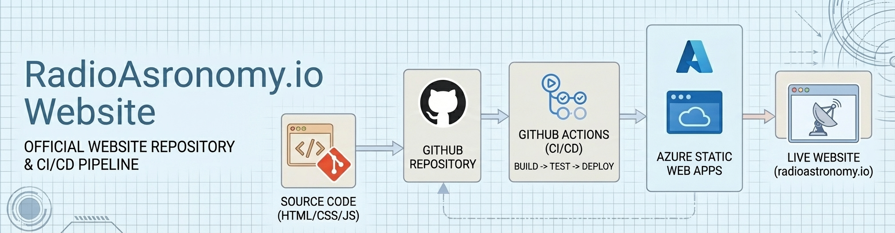

<!--
---
title: "RadioAstronomy.io Website"
description: "Public website for the radioastronomyio GitHub organization"
author: "VintageDon"
date: "2026-04-18"
version: "2.0"
status: "Active"
tags:
  - type: project-root
  - domain: [website, static-site]
  - tech: [astro, tailwind, typescript, azure-swa]
related_documents:
  - "[Website Specification](docs/website-reference.md)"
  - "[Live Site](https://radioastronomy.io)"
---
-->

# RadioAstronomy.io Website

> Public website for the radioastronomyio GitHub organization, built with Astro, Tailwind CSS, and TypeScript. Deployed on Azure Static Web Apps.

[](https://radioastronomy.io)
[](https://azure.microsoft.com/en-us/products/app-service/static)
[](https://github.com/features/actions)
[](https://astro.build)
[](https://tailwindcss.com)
[](LICENSE)



This repository contains the public website for the [radioastronomyio](https://github.com/radioastronomyio) GitHub organization, a 14-page site showcasing computational astronomy research projects, infrastructure documentation, governance practices, and the organization's open-science approach.

---

## Repository Structure

```
radioastronomyio-website/
├── .github/workflows/            # Azure SWA CI/CD deployment
├── assets/                       # Repo-level banners, sponsor logos, founder headshot, infographics
├── docs/
│   ├── documentation-standards/  # Templates, tagging strategy
│   └── website-reference.md      # v1 specification (archived)
├── src/                          # v2 (live) - Astro + Tailwind + TypeScript
│   ├── src/
│   │   ├── components/           # Shared UI components (15)
│   │   ├── content/              # Content collections (sponsors, projects)
│   │   ├── layouts/              # PageLayout, ProjectPageLayout
│   │   └── pages/                # Routes (14 pages)
│   ├── public/images/            # Assets (sponsors, projects, founder, heroes, og, logo)
│   ├── astro.config.mjs
│   ├── tailwind.config.mjs
│   ├── tsconfig.json
│   ├── package.json
│   └── staticwebapp.config.json  # Caching, headers, routing, legacy redirects
├── legacy-v1/                    # v1 (archived) - Original vanilla HTML/CSS/JS site
├── work-logs/                    # Development history
├── AGENTS.md                     # AI agent context
├── CLAUDE.md                     # Pointer to AGENTS.md
├── LICENSE                       # MIT
└── README.md                     # This file
```

---

## Local Development

```bash
cd src
npm install
npm run dev
# Open http://localhost:4321
```

---

## Related Projects

This website showcases the [radioastronomyio](https://github.com/radioastronomyio) research program:

| Project | Description |
|---------|-------------|
| [proxmox-astronomy-lab](https://github.com/radioastronomyio/proxmox-astronomy-lab) | Platform documentation, VM inventory, network architecture |
| [desi-cosmic-void-galaxies](https://github.com/radioastronomyio/desi-cosmic-void-galaxies) | Galaxy populations in cosmic voids using DESI DR1 |
| [desi-quasar-outflows](https://github.com/radioastronomyio/desi-quasar-outflows) | AGN outflow spectral fitting and Cloudy modeling |
| [desi-qso-anomaly-detection](https://github.com/radioastronomyio/desi-qso-anomaly-detection) | ML anomaly detection for quasar spectra |
| [rbh1-validation-reanalysis](https://github.com/radioastronomyio/rbh1-validation-reanalysis) | Independent validation of the RBH-1 hypervelocity SMBH candidate |
| [desi-lsst-transient-anomalies](https://github.com/radioastronomyio/desi-lsst-transient-anomalies) | DESI-contextualized Rubin/LSST transient anomaly detection |
| [cosmos2025-anomalies](https://github.com/radioastronomyio/cosmos2025-anomalies) | Anomaly detection on COSMOS-Web DR1 imaging |

---

## Acknowledgments

- [Azure Static Web Apps](https://azure.microsoft.com/en-us/products/app-service/static) for managed hosting
- [Cloudflare](https://www.cloudflare.com/) for DNS and CDN proxying
- [GitHub Actions](https://github.com/features/actions) for CI/CD pipeline

---

## License

This project is licensed under the MIT License. See [LICENSE](LICENSE) for details.
