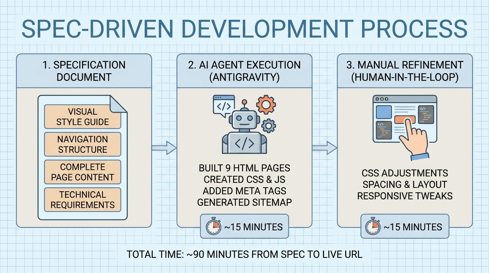
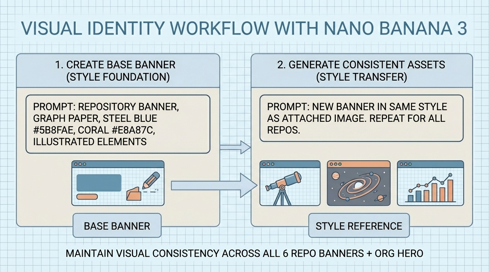

<!--
---
title: "RadioAstronomy.io Website"
description: "Public website for the radioastronomyio GitHub organization"
author: "VintageDon"
date: "2026-03-29"
version: "1.1"
status: "Active"
tags:
  - type: project-root
  - domain: [website, static-site]
  - tech: [html, css, javascript, azure-swa]
related_documents:
  - "[Website Specification](docs/website-reference.md)"
  - "[Live Site](https://radioastronomy.io)"
---
-->

# 🌐 RadioAstronomy.io Website

> An experiment in spec-driven development, from specification to live site in 90 minutes using AI agents, style-consistent graphics, and Azure Static Web Apps.

[](https://radioastronomy.io)
[](https://azure.microsoft.com/en-us/products/app-service/static)
[](https://github.com/features/actions)
[](https://developer.mozilla.org/en-US/docs/Web/HTML)
[](https://developer.mozilla.org/en-US/docs/Web/CSS)
[](https://developer.mozilla.org/en-US/docs/Web/JavaScript)
[](LICENSE)


This repository contains the public website for the [radioastronomyio](https://github.com/radioastronomyio) GitHub organization, a 9-page static site showcasing computational astronomy research projects, infrastructure documentation, and data science methodologies. The site was built as an open experiment in spec-driven development, demonstrating how AI coding agents can transform a detailed specification into production-ready code with minimal manual intervention.

---

## 🎯 Quick Navigation

### For Site Visitors

- [🌐 Live Site](https://radioastronomy.io) — The deployed website
- [📖 Research Overview](https://radioastronomy.io/research.html) — Galaxy evolution, cosmic voids, quasar physics
- [🖥️ Infrastructure](https://radioastronomy.io/infrastructure.html) — Compute cluster and data architecture

### For Developers

- [📋 Website Specification](docs/website-reference.md) — Complete content and style reference
- [🎨 CSS Architecture](src/css/styles.css) — Commented stylesheet with design rationale
- [⚡ JavaScript](src/js/main.js) — Dual-audience commented interactivity

### For Replicators

- [1. Spec-Driven Development](#-spec-driven-development) — The methodology
- [2. Visual Identity](#-visual-identity-with-nano-banana-3) — Consistent graphics workflow
- [3. Azure Static Web Apps](#-azure-static-web-apps) — Free hosting tutorial

---

## 🧪 Open Methodology

This project documents its entire development process. The goal isn't just a website; it's a reproducible template for spec-driven static site development.

| Metric | Value |
|--------|-------|
| Total time (spec to live site) | ~90 minutes |
| Specification size | ~2,000 words |
| AI agent execution | ~15 minutes (4 iterative prompts) |
| Manual refinement | ~15 minutes |
| Pages | 9 (3 main + 6 repository pages) |

---

## 🏗️ Repository Structure

```
radioastronomyio-website/
├── 📂 .github/workflows/            # Azure SWA deployment
├── 📂 assets/                       # Banners and infographics
├── 📂 docs/
│   ├── 📂 documentation-standards/  # Templates, tagging strategy
│   └── 📄 website-reference.md      # The specification
├── 📂 internal-files/               # Working documents
├── 📂 shared/                       # Cross-project utilities
├── 📂 spec/                         # Specifications
├── 📂 src/                          # Deployed to Azure SWA
│   ├── 📄 index.html
│   ├── 📄 research.html
│   ├── 📄 infrastructure.html
│   ├── 📂 repos/                    # 6 repository detail pages
│   ├── 📂 css/                      # Commented stylesheet
│   ├── 📂 js/                       # Commented interactivity
│   ├── 📂 assets/                   # Site images
│   ├── 📄 sitemap.xml
│   └── 📄 staticwebapp.config.json  # Caching, headers, routing
├── 📂 staging/                      # Staged work
├── 📂 work-logs/                    # Development history
├── 📄 AGENTS.md                     # Agent context
├── 📄 CLAUDE.md                     # Pointer to AGENTS.md
├── 📄 LICENSE
└── 📄 README.md                     # This file
```

---

## 📋 Spec-Driven Development

The core idea: write a complete specification before any code exists, then hand it to an AI coding agent.



### The Specification Document

We created [`docs/website-reference.md`](docs/website-reference.md) containing:

| Section | Contents |
|---------|----------|
| Visual style guide | Color palette, typography, card styles (derived from existing graphics) |
| Navigation structure | Page hierarchy, dropdown behavior, mobile patterns |
| Complete page content | Every heading, paragraph, and section for all 9 pages |
| Technical requirements | SEO meta tags, structured data, accessibility notes |

The spec was ~2,000 words covering everything needed to build the site without ambiguity.

### AI Agent Execution

We used [Antigravity](https://www.antigravity.dev/) (Flash tier) with the spec as input. The agent:

- Built all 9 HTML pages with content from the spec
- Created CSS with custom properties matching the style guide
- Implemented JavaScript for navigation, scroll effects, animated counters, lightbox, and collapsibles
- Added Open Graph and Twitter Card meta tags
- Generated sitemap.xml

Total agent execution time: ~15 minutes over 4 iterative prompts of increasing difficulty.

### Manual Refinement

Some CSS adjustments were made interactively with Claude:

| Adjustment | Reason |
|------------|--------|
| Banner width 100% to 80% | Full-width felt visually heavy |
| Container width % to fixed px | Proper zoom behavior |
| Spacing xl to lg | Tighter visual rhythm |

These refinements took ~15 minutes of iterative discussion and testing.

---

## 🎨 Visual Identity with Nano Banana 3

All graphics (banners, hero images, infographics) were created using [Nano Banana 3](https://www.nanobanana.com/), an AI image generator that excels at style consistency through reference images.



### The Workflow

Step 1: Create a base banner

We started with one repository banner, iterating a few times until the style was right: graph paper background, steel blue (#5B8FAE) primary color, coral (#E8A87C) accents, illustrated infographic elements.

Step 2: Use the base as a style reference

For subsequent banners, the prompt was simple:

> The attached images are repository banners for a set of repositories under a single GitHub org at <https://github.com/radioastronomyio>. They are styled, colored, themed, and aspect ratio'd similar. I need a new repository banner in the same style based off the attached readme. We will be doing several banners in this same style in this chat.

Then for each additional repository:

> Repeat the last process for this new readme.

That's it. NB3's style transfer capabilities maintained visual consistency across all 6 repository banners plus the org hero image and infographics.

---

## ☁️ Azure Static Web Apps

Azure Static Web Apps (SWA) is a fully managed hosting service for static websites. It handles SSL certificates, global CDN distribution, and continuous deployment from GitHub, all automatically.


### What Static Web Apps Supports

SWA works with any static site generator or framework:

| Category | Examples |
|----------|----------|
| No build step | Plain HTML/CSS/JS (what we used) |
| JavaScript frameworks | React, Vue, Angular, Svelte |
| Static site generators | Hugo, Jekyll, Gatsby, Astro, Next.js (static export) |
| Other | Blazor WebAssembly, any SPA |

For sites with no build step, Azure simply serves files directly from your repository.

### Free Tier Allowances

The free tier is generous for personal/hobby projects:

| Resource | Allowance |
|----------|-----------|
| Bandwidth | 100 GB/month |
| Storage | 250 MB per app (500 MB total) |
| Custom domains | 2 |
| Staging environments | 3 |
| SSL certificates | Free (auto-managed) |
| CDN | Global edge distribution |
| Apps per subscription | 10 |

If you exceed 100 GB bandwidth, the site stops serving until the next billing cycle; no surprise charges.

---

## 🚀 Creating the Azure Static Web App

### Step 1: Create the Resource

1. Go to [Azure Portal](https://portal.azure.com)
2. Search for "Static Web Apps," click Create
3. Fill in: Subscription, Resource group, Name, Plan type (Free), Region
4. Under "Deployment details": Source GitHub, authorize, select repo and branch
5. Under "Build Details": Build Presets Custom, App location `/src`, API location empty, Output location empty

Click "Review + Create," then "Create"

### Step 2: What Happens Next

Azure automatically:

1. Creates a GitHub Action workflow file in your repository
2. Adds `AZURE_STATIC_WEB_APPS_API_TOKEN` to your repository secrets
3. Triggers the first deployment

Within 1-2 minutes, your site is live at `https://<prefix>.azurestaticapps.net`.

### The Generated Workflow

For a no-build static site, the key settings in the workflow are:

```yaml
app_location: "/src"       # Where your HTML files live
output_location: ""        # Empty, no build output
skip_app_build: true       # Optional but recommended
```

---

## 🌍 Custom Domain Setup

The free tier supports custom domains but with one constraint: CNAME only (no A record option). This works fine with most DNS providers.

### Our Setup

| Setting | Value |
|---------|-------|
| Domain | radioastronomy.io |
| DNS Provider | Cloudflare (free plan) |
| Records | Proxied through Cloudflare |

### Step-by-Step

Step 1: Add custom domain in Azure Portal, navigate to Custom domains, click Add

Step 2: Verify ownership with a TXT record (`_dnsauth` with Azure-provided value)

Step 3: Add CNAME records pointing to your Azure URL for both `@` and `www`

> Note: Some DNS providers don't support CNAME at the apex (`@`). Cloudflare does via CNAME flattening.

Step 4: Enable proxying (Cloudflare): set proxy status to "Proxied" (orange cloud) for both records

Step 5: Wait for DNS propagation. Azure automatically provisions an SSL certificate once propagation completes.

---

## 📝 Work Logs

| Phase | Description | Status |
|-------|-------------|--------|
| [01-ideation-and-setup](work-logs/01-ideation-and-setup/) | Planning, assets, reference document | ✅ Complete |
| [02-website-development](work-logs/02-website-development/) | Antigravity build, manual refinements | ✅ Complete |

---

## 💻 Local Development

```bash
# Option 1: Python
cd src
python -m http.server 8000

# Option 2: VS Code Live Server extension

# Then open http://localhost:8000
```

---

## 🔗 Related Projects

This website showcases the [radioastronomyio](https://github.com/radioastronomyio) research program:

| Project | Description |
|---------|-------------|
| [proxmox-astronomy-lab](https://github.com/radioastronomyio/proxmox-astronomy-lab) | Platform documentation, VM inventory, network architecture |
| [desi-cosmic-void-galaxies](https://github.com/radioastronomyio/desi-cosmic-void-galaxies) | Galaxy populations in cosmic voids using DESI DR1 |
| [desi-quasar-outflows](https://github.com/radioastronomyio/desi-quasar-outflows) | AGN outflow spectral fitting and Cloudy modeling |
| [desi-qso-anomaly-detection](https://github.com/radioastronomyio/desi-qso-anomaly-detection) | ML anomaly detection for quasar spectra |

---

## 🙏 Acknowledgments

- [Antigravity](https://www.antigravity.dev/) for AI-powered spec-driven development
- [Nano Banana 3](https://www.nanobanana.com/) for AI image generation with style transfer
- [Claude](https://claude.ai/) for interactive CSS refinement and code commenting
- [Azure Static Web Apps](https://azure.microsoft.com/en-us/products/app-service/static) for free managed hosting
- [Cloudflare](https://www.cloudflare.com/) for DNS and CDN proxying
- [GitHub Actions](https://github.com/features/actions) for CI/CD pipeline

---

## 📜 License

This project is licensed under the MIT License. See [LICENSE](LICENSE) for details.

---

Last Updated: 2026-03-29 | Spec-Driven Development Experiment
